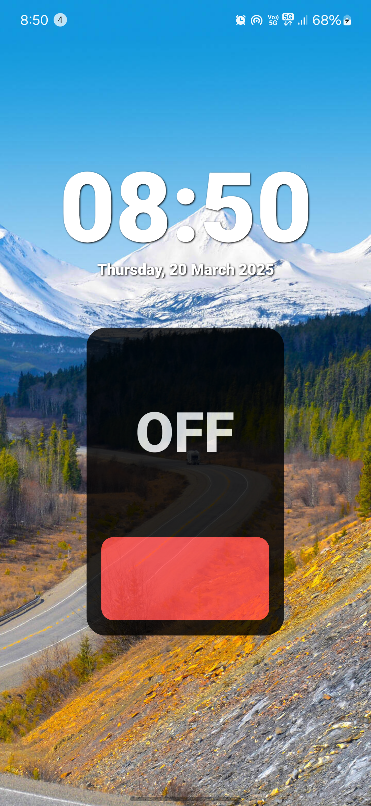

# 🔦 Flashlight Android App

The **Flashlight App** is a simple, fast, and lightweight Android application designed to instantly turn your device's camera flash into a powerful flashlight. This app is optimized for smooth performance, low battery consumption, and works on almost all Android devices.

---

## ✨ Features
- ✅ One-tap flashlight ON/OFF
- ✅ Bright and stable flashlight
- ✅ Minimalist black & white user interface
- ✅ Fast response with smooth performance
- ✅ Works offline — no internet required
- ✅ Lightweight and battery-friendly
- ✅ Supports most Android phones and tablets

---

## 📸 Screenshots

|  |  |

---

## 🚀 How to Use
1. Open the **Flashlight App**
2. Tap the **Power Button** to turn ON the flashlight
3. Tap again to turn it OFF
4. Use it anytime — even offline

---

## 🛠 Tech Stack
- **Language:** Java
- **UI Design:** XML (Black & White Theme)
- **IDE:** Android Studio
- **Minimum SDK:** Android 5.0 (Lollipop)

---

## 📥 Download APK
👉 [Download Latest APK](https://your-apk-download-link)

---

## 📚 License
This project is licensed under the **MIT License**  
✅ Free for personal, educational, and commercial use

---
